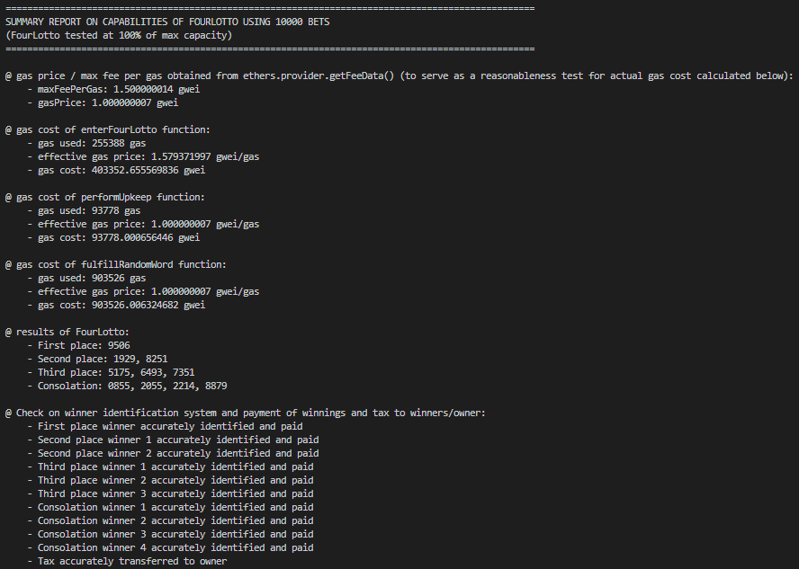
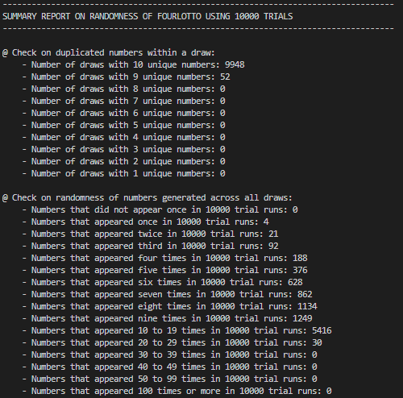
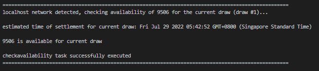
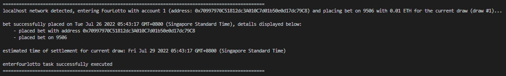
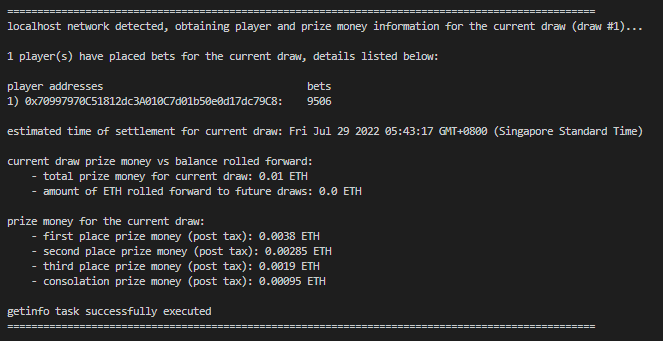
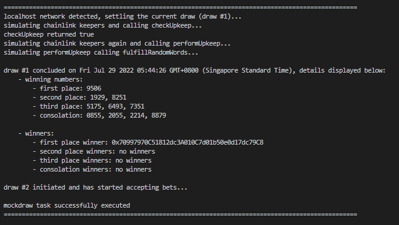
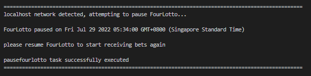
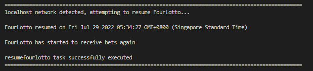
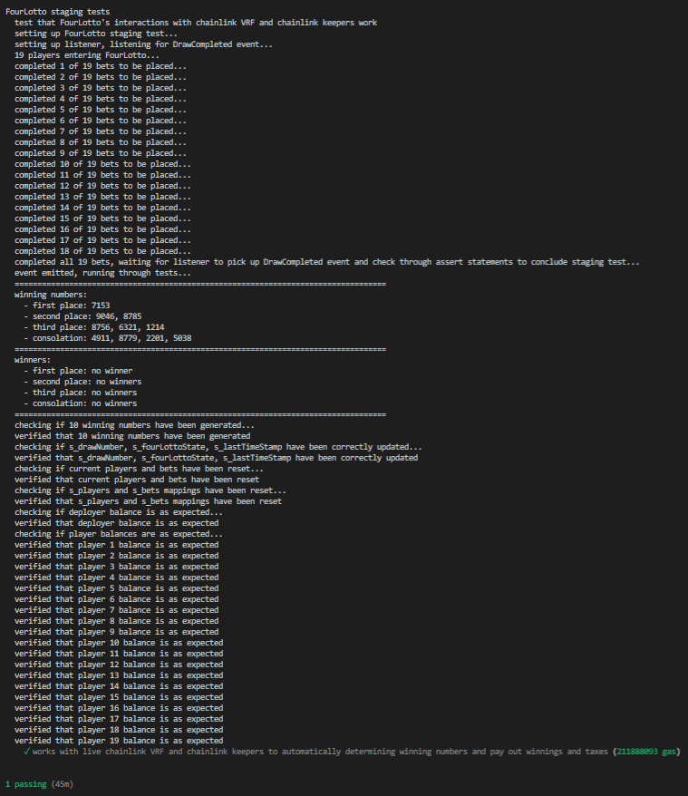

<div id="top"></div>

<!-- PROJECT HEADER -->

<font size="8"><h3 align="center">FourLotto</h3></font>
<br/>

<!-- TABLE OF CONTENTS -->

# Table of Contents

  <ol>
    <li>
      <a href="#about-the-project">About The Project</a>
      <ul>
        <li><a href="#built-with">Built With</a></li>
      </ul>
    </li>
    <li>
      <a href="#more-about-fourlotto">More About FourLotto</a>
      <ul>
        <li><a href="#entry-details">Entry Details</a></li>
        <li><a href="#prize-details">Prize Details</a></li>
        <li><a href="#anti-cheat-system">Anti-cheat System</a></li>
        <li><a href="#draw-details">Draw Details</a></li>
        <li><a href="#generation-of-winning-numbers">Generation Of Winning Numbers</a></li>
      </ul>
    </li>
    <li>
      <a href="#getting-started">Getting Started</a>
      <ul>
        <li><a href="#requirements">Requirements</a></li>
        <li><a href="#installation">Installation</a></li>
      </ul>
    </li>
    <li>
      <a href="#usage">Usage</a>
      <ul>
        <li><a href="#deploy">Deploy</a></li>
        <li><a href="#testing">Testing</a></li>
        <li><a href="#test-coverage">Test Coverage</a></li>
        <li><a href="#scripts">Scripts</a></li>
        <li><a href="#tasks">Tasks</a></li>
      </ul>
    </li>
    <li><a href="#deployment-to-testnet">Deployment To Testnet</a></li>
    <li><a href="#roadmap">Roadmap</a></li>
    <li><a href="#current-issues">Current Issues</a></li>
    <li><a href="#features-to-be-considered">Features To Be Considered</a></li>
    <li><a href="#request-for-feedback-and-suggestions-for-improvement">Request For Feedback And Suggestions For Improvement</a></li>
    <li><a href="#contact">Contact</a></li>
    <li><a href="#acknowledgments">Acknowledgments</a></li>
  </ol>
<br/>

<!-- ABOUT THE PROJECT -->

# About The Project

FourLotto, a smart contract lottery, seeks to rely on the decentralised nature of blockchain technology to create a fair and just lottery which programmatically determines 10 random winning numbers each draw, identifies winners and pays out prize money. The source code and all transactions are readily available to guarantee transparency.

If you would like to view the FourLotto smart contract lottery, I have deployed FourLotto on the rinkeby testnet at the following address:

-   0x5908f34E510a34910983884d2558ce9Da0Db0392

The FourLotto smart contract is verified on the rinkeby testnet blockchain explorer so you can refer to it if the UI makes it easier to view the different functions included in this project

This is my first pet project as I embark on my journey to learn more about smart contract development and becoming a proficient developer in the blockchain and cryptocurrency space. I am also currently looking for employment in this space (open to both fulltime or internship opportunities) and would thus greatly appreciate any opportunities that could be sent my way.

<br/>

## Built With

This project is built using the following frameworks/libraries:

-   [](https://github.com/smartcontractkit/chainlink)
-   [](https://hardhat.org/)
-   [](https://github.com/OpenZeppelin/openzeppelin-contracts)

<p align="right">(<a href="#top">back to top</a>)</p>

<!-- MORE ABOUT FOURLOTTO -->

# More About FourLotto

## Entry Details

Each address is only entitled to placing one bet on one four digit number. Each four digit number can only be bet on once by an address, afterwhich any subsequent address which tries to place a bet on that four digit number will be blocked from doing so. Each bet costs 0.01 ETH.

As bets are tied to addresses and not to any User ID, players are allowed to place multiple bets on multiple four digit numbers via multiple addresses. However, to prevent such players from gaining an unfair advantage, to be explained in further details in the later sections, the total prize money available for a particular draw is capped at 100 ETH. Any remaining amounts of prize money (either in excess of 100 ETH or undistributed from previous draws) will be rolled forward for future draws. All bets, irregardless of whether the bet has or has not won any prizes, will be wiped once a draw has concluded.

A 5% tax is imposed on prize money won by winners for the upkeep and development of this lottery smart contract. This tax will only be applied if winners have been identified, i.e., if there are no winners for a particular draw, no tax will be imposed for that draw.

<br/>

## Prize Details

The total prize money for a draw is allocated amongst the four different tiers of winning numbers as shown below:

-   First Place (up to one winner): 40% of the total prize money before tax (capped at 40 ETH)
-   Second Place (up to two winners): 30% of the total prize money before tax (capped at 30 ETH)
-   Third Place (up to three winners): 20% of the total prize money before tax (capped at 20 ETH)
-   Consolation (up to four winners): 10% of the total prize money before tax (capped at 10 ETH)

Prize money allocated to the winners in each tier will be split evenly amongst all winners identified for a particular tier, e.g., if there are three third place winners, 20% of the total prize money will be split evenly amongst the three winners. A player will therefore be entitled to the entire share of prize money allocated to the winners of a particular tier if he or she is the only winner identified for that tier, e.g., if there is only one second place winner identified, he or she will received the entire 30% of the total prize money allocated to second place winners.

Since the winning numbers are generated randomly with no checks performed for duplicate numbers to ensure complete random winning numbers, there are two scenarios that need to be specifically addressed:

1.  In the event that there are duplicate numbers in a particular tier, e.g., if a number appears twice in the four winning numbers for the consolation prize, this number will be treated as if it were two unique numbers and the consolation prize winners will be paid accordingly (i.e., assuming players have bet on the other two consolation winning numbers, this player will receive 50% of the consolation prize money instead of 33%). This is subject to further changes if it is decided that this current system of handling duplicate numbers in the same tier of prize money is unfair.

2.  In the event that a number appears in two or more tiers of winning numbers, the player who has bet on this number will receive his or her share of the prize money for each of the tiers in which this number appears (e.g., if a number appears in both first place and third place, the player who has bet on this number will be entitled to his or her share of the 40% allocated to the first place winner, and the 20% allocated to third place winners)

These scenarios are rare and are not expected to occur frequently since the probability of not obtaining 10 unique numbers for a draw is, in theory, only around 0.45%. Assuming the VRFCoordinateV2Mock provides an accurate representation of the randomness of the winning numbers generated, based on a trial of 10000 draws, 9,948 draws had 10 unique winning numbers while only 52 draws had nine unique winning numbers (i.e., one number appeared twice in these 52 draws.) This is roughly in line with the expected 0.45% chance of having less than 10 unique numbers generated in a draw, which speaks volumes of the randomness of this lottery.

<br/>

## Anti-cheat system

As mentioned in earlier sections, any remaining amounts of prize money, either in excess of 100 ETH or not distributed for a draw, will be rolled forward to subsequent draws.

Given that each number can only be bet on once, and each bet costs 0.01 ETH, excluding gas fees, the total cost of placing bets on all 10,000 four digit numbers and, in doing so, guaranteeing a 100% chance of winning the entirety of the total prize money for a particular draw, is 100 ETH.

Disregarding gas fees and the 5% tax imposed on prize money received, if no hard cap is placed on a draw's prize money, a player could in theory game the lottery by placing bets on all 10,000 four digit numbers and guaranteeing themselves prize money above 100 ETH if undistributed prize money from previous draws have exceeded 100 ETH. This also prevents other players from placing bets and denying them their chances of winning for that draw.

Placing a hard cap of 100 ETH will therefore disincentivise such behavior since this hard cap makes such behavior -EV.

<br/>

## Draw Details

FourLotto draws occur once every three days (beginning from the time that the first bet is placed), where 10 winning numbers are generated and prize money is paid out to any winners identified. The frequency of draws is subject to changes, depending on the participation of players once this lottery is launched. The system for the generation of the 10 winning numbers is described in the subsequent section.

Chainlink keepers are used to automatically generate winning numbers and pay out prize money three days from the first player's bet.

If the traffic for FourLotto slows down or players have not placed bets for a considerable duration of time, the owner for FourLotto will be able to temporarily pause FourLotto. When FourLotto is paused, all bets placed by players for the current draw will be refunded with the remaining extracted to the owner. No bets will be accepted by FourLotto when it is paused. If demand returns, FourLotto can be resumed by the owner at a later date.

<br/>

## Generation Of Winning Numbers

FourLotto utilises Chainlink VRF to obtain 41 verifiable random numbers. These 41 uint256 values are used to determine the winning numbers based on the following system:

-   The 1st verifiable random number will be used to determine the "order" of arranging the four single integers obtained from the next 10 sets of four verifiable numbers to determine 10 winning numbers.
-   The first place number is obtained from the 2nd to 5th verifiable random numbers.
-   The second place numbers are obtained from the 6th to 9th and the 10th to 13th verifiable random numbers.
-   The third place numbers are obtained from the 14th to 17th, the 18th to 21st, and the 22nd to 25th verifiable random numbers.
-   The consolation numbers are obtained from the 26th to 29th, the 30th to 33rd, the 34th to 37th, and the 38th to 41st verifiable random numbers.

The process of generating these 10 winning numbers is as follows:

1.  The s_winningNumberOrderArray state variable contains all 24 permutations of creating a four digit number from four single integers.
2.  The 1st verifiable random number will be modded by 24 to obtain a random value between 0 to 23. The element at the index position of s_winningNumberOrderArray that corresponds to the random value obtained between 0 to 23 will then be selected as the "order" to arrange the next 10 sets of four single integers obtained to form the 10 winning numbers for the draw.
3.  The first set of four verifiable random numbers (i.e., the 2nd to 5th verifiable random numbers) will each be separately modded by 10 to obtain four random integers betweem 0 to 9, which will then be arranged based on the "order" identified in step 2 to form the draw's first place number.
4.  Step 3 is repeated for the remaining nine sets of four verifiable random numbers to determine the remaining 9 winning numbers for the draw.
5.  This process is performed for each draw to ensure that the 10 winning numbers identified for each draw are as random as possible.

<p align="right">(<a href="#top">back to top</a>)</p>

<!-- GETTING STARTED -->

# Getting Started

This section provides the requirements for this project and instructions on how to clone this project for testing if desired.

<br/>

## Requirements

-   [git](https://git-scm.com/book/en/v2/Getting-Started-Installing-Git)
    -   If git is installed, running `git --version` will give a response that looks like `git version x.x.x`
-   [Nodejs](https://nodejs.org/en/)
    -   If nodejs is installed, running `node --version` will give a response that looks like `vx.x.x`
-   [Yarn](https://yarnpkg.com/getting-started/install)
    -   This project utilises `yarn` instead of `npm`
        -   If yarn is installed, running `yarn --version` will give a response that looks like `x.x.x`
        -   You might need to install it with [`npm`](https://classic.yarnpkg.com/lang/en/docs/install/)

<br/>

## Installation

To clone this git repository for testing purposes, execute the following commands:

1.  Clone this git repository in your current directory

```
    git clone XXX
```

2.  Enter the project file

```
    cd XXX
```

3.  Install all required packages

```
    yarn
```

4. Create a .env file based on the .env.example file contained in this git repository and populate with your own private keys and API keys.

<p align="right">(<a href="#top">back to top</a>)</p>

<!-- USAGE EXAMPLES -->

# Usage

This section provides the commands to deploy, perform tests and run scripts contained within this git repository on the hardhat network. Some tasks to interact with FourLotto on the localhost network or testnets / mainnet are also documented in this section.

<br/>

## Deploy

To deploy this smart contract lottery to the hardhat network, use the following command:

```
hh deploy
```

<br/>

## Testing

To run through tests for this project, use the following command:

```
hh test
```

<br/>

## Test Coverage

The tests contained in this git repository cover 100% of all statements and functions in the FourLotto smart contract. The 11 branches and lines not covered by the tests included in this repository mostly pertain to if statements following the transfer of ETH to players and the owner via .call().

To test the coverage, use the following commands:

```
hh coverage
```

The index.html file created in the coverage folder after running the commands above can be viewed to examine the coverage of the tests contained within this git repository.

<br/>

## Scripts

This git repository comes with scripts that will prove useful for testing the capabilities of the FourLotto smart contract. The current scripts contained will be improved on and more will be added at a later date if required.

Also note that as these scripts require a large number of accounts, executing these scripts will take a substantial amount of time. These scripts are only meant for the hardhat network.

To run any of the following scripts, use the following command, with XXXXXXXXXXX being the name of the script to be executed:

```
hh run scripts/XXXXXXXXXXX.js
```

<br/>

1.  capabilitiescheck.js

This script checks FourLotto's ability to handle a large number of player bets to ensure that it is capable of handling up to 10,000 bets for a draw (the maximum number of bets for a draw), and also provides information such as the amount of gas required for players to place bets and the amount of gas required for the fulfillRandomWords function, this smart contract's most gas heavy function.

Before running this script, please update the following:

-   `numberOfBetsPlaced` variable found near the top of the capabilitiescheck.js script should be set to the desired number of bets.
-   `counts` under the hardhat network in `hardhat.config.js` should be set to 10,000
-   Also, when testing with a large number of bets, be sure to check that the `blockGasLimit` value in `hardhat.config.js` and the `callbackGasLimit` value in `helper-hardhat.config.js` are large enough to support testing with that many bets. From prior testing, setting `blockGasLimit` to 15,000,000 and `callbackGasLimit` to 2,500,000 is sufficient to run capabilitiescheck with 10,000 bets.

This script initially generated 10,000 random wallets and proceeded to use them to place the required number of bets but this resulted in the script taking over two hours to complete 10,000 bets. The current version of this script therefore utilises the test accounts when starting up the hardhat network, which makes it vital to set the accounts "generated" by hardhat to 10,000 in order for the script to work as intended.

A sample of the summary report obtained from running this script is shown below:

<div align="left"></div>

<br/>

2. randomnesscheck.js

This script checks the randomness of the winning numbers determined by FourLotto, and provides information such as the number of draws with duplicate numbers and a breakdown on the frequency that numbers appeared in the trials performed. This script also provides a log of each draw's winning numbers, although most will not be available if testing beyond 1,000 draws since the CLI is only capable of displaying hundreds of lines of text.

Before running this script, please update the numberOfTrials variable found near the top of the script to the desired number of draws.

A sample of the summary report obtained from running this script is shown below:

<div align="left"></div>

<br/>

## Tasks

This git repository comes with some tasks that can be used to interact with the FourLotto smart contract. Further improvements and more tasks may be added in the future as and when required.

These tasks can interact with FourLotto on the localhost network, or testnets / mainnet. However, note that the mockdraw task is only available for the localhost network, and the performupkeep task is only avaiable for testnets / mainnet (in the event that the Chainlink Keepers fail to automatically call the performUpkeep function)

<br/>

1.  checkavailability.js

This task can be used to check the availability of a four digit number for the current draw.

This task takes one mandatory positional parameter, the four digit number to be checked.

The checkavailability task can be executed with the following command:

```
hh checkavailability YYYY --network ZZZZ
```

where,

-   YYYY = the four digit number to be checked for availability
-   ZZZZ = the network that FourLotto is deployed to (e.g., localhost or rinkeby)

This task should log the following in CLI if executed successfully.

<div align="left"></div>

<br/>

2. displaycommands.js

This task can be used to display all the available commands to interact with FourLotto on the localhost network or testnets / mainnet.

The displaycommands task can be executed with the following command:

```
hh displaycommands
```

This task should log the following text in CLI when executed.

<div align="left"></div>

<br/>

3.  enterfourlotto.js

This task can be used to enter FourLotto and place a bet on a specified number.

The enterFourLotto task requires two mandatory positional parameters, the account to place the bet with, and the number to place the bet on.

The enterFourLotto task can be executed with the following command:

```
hh enterfourlotto X YYYY --network ZZZZ
```

where,

-   X = the index position of the account contained in the hardhat.config.js file for the desired network
-   YYYY = the four digit number to place bet on
-   ZZZZ = the network that FourLotto is deployed to (e.g., localhost or rinkeby)

This task should log the following in CLI if executed successfully.

<div align="left"></div>

<br/>

4.  getinfo.js

This task can be used to obtain information for the current draw, such as the list of players who have placed bets for the current draw, the numbers that they have placed their bets on, and the prize money information.

The getinfo task can be executed with the following command:

```
hh getinfo --network ZZZZ
```

where,

-   ZZZZ = the network that FourLotto is deployed to (e.g., localhost or rinkeby)

This task should log the following in CLI if executed successfully.

<div align="left"></div>

<br/>

5.  mockdraw.js

This task is only available on the localhost network and can be used to settle the current draw by generating the 10 winning numbers, identifying winners, and paying them their share of the prize money if any have been identified.

The mockdraw task can be executed with the following command:

```
hh mockdraw --network ZZZZ
```

where,

-   ZZZZ = the network that FourLotto is deployed to (e.g., localhost or rinkeby)

This task should log the following in CLI if executed successfully.

<div align="left"></div>

<br/>

6. pausefourlotto.js

This task can be used to pause FourLotto, but only when FourLotto is open and has a balance greater than 0 ETH.

The pausefourlotto task can be executed with the following command:

```
hh pausefourlotto --network ZZZZ
```

where,

-   ZZZZ = the network that FourLotto is deployed to (e.g., localhost or rinkeby)

This task should log the following text in CLI if executed successfully.

<div align="left"></div>

<br/>

7. performupkeep.js

This task is only meant to be used as a backup option. When the Chainlink Keepers do not do their job, the deployer can use this performupkeep task to call the performUpkeep function and settle the current draw. This task is therefore only meant for testnets / mainnet and will not work when FourLotto is deployed to the localhost network.

The performupkeep task can be executed with the following command:

```
hh performupkeep --network ZZZZ
```

where,

-   ZZZZ = the network that FourLotto is deployed to (e.g., localhost or rinkeby)

As all interactions with Chainlink Keepers have been successful so far, there has not been a need for this performupkeep task and therefore no screen captures of the resulting text after performupkeep is successfully executed is available at this point in time.

<br/>

8. resumefourlotto.js

This task can be used to resume FourLotto after it has been paused.

The resumefourlotto task can be executed with the following command:

```
hh resumefourlotto --network ZZZZ
```

where,

-   ZZZZ = the network that FourLotto is deployed to (e.g., localhost or rinkeby)

This task should log the following text in CLI if executed successfully.

<div align="left"></div>

<p align="right">(<a href="#top">back to top</a>)</p>

<!-- DEPLOYMENT TO TESTNET -->

# Deployment To Testnet

1. Setup .env file

As mentioned above, with reference to the .env.example file, create a .env file which should contain information such as the `RINKEBY_RPC_URL` and private keys used to deploy and interact with FourLotto.

<br/>

2. Setup Chainlink VRF subscription

This project utilises the Chainlink VRF to obtain random numbers. For FourLotto to work, you would therefore need to set up a Chainlink VRF subscription and update the `subscriptionId` found in `helper-hardhat.config.js` under the section for the testnet that you will be deploying to. Remember to add the deplyed FourLotto contract as a consumer under your Chainlink VRF subscription once it has been deployed

<br/>

3. Deploying to testnet

The following command can be used to deploy FourLotto to a testnet:

```
hh deploy --network ZZZZ
```

where,

-   ZZZZ = the network that FourLotto is deployed to (e.g., rinkeby or any other testnet)

The deploy script a separate verify.js script (found in the utils folder) to programmatically verify FourLotto after deployment to a testnet. This verify.js script works only if an etherscan API key is included in the .env file (as seen in the .env.example file).

Alternatively, if the verification fails while deploying FourLotto to a testnet, the following command can be used to verify FourLotto:

```
hh verify (address of deployed FourLotto contract) (constructor arguments)
```

<br/>

4. Adding FourLotto to Chainlink Keepers

This project utilises Chainlink Keepers to automatically settle draws three days after the first player has placed a bet for the current draw. Therefore, make sure to register a new upkeep for the deployed FourLotto contract so that the Chainlink Keepers can call the performUpkeep function.

To make it easier to test the interactions between FourLotto, Chainlink VRF, and Chainlink Keepers, the frequency of draws is currently set to 360 seconds for the rinkeby testnet in `helper-hardhat.config.js`.

<br/>

5. Interacting with FourLotto

The tasks listed above, with the exception of mockdraw.js can be used to interact with the deployed FourLotto on the testnet.

<p align="right">(<a href="#top">back to top</a>)</p>

<!-- ROADMAP -->

# Roadmap

This section documents additional features and improvements that may be added to this project in the future.

-   Develop frontend
-   Improve on security
-   Add more tasks, if any are required
-   Additional features that may be added

    -   Leaderboard to show past winners and amount of ETH won
    -   Graph or some other form of graphics to show history of winning numbers to justify randomness of winning numbers generated
    -   Allowing addresses to place bets on multiple four digit numbers per draw

<p align="right">(<a href="#top">back to top</a>)</p>

<!-- CURRENT ISSUES -->

# Current Issues

This section documents issues that I am currently facing with regard to this project:

1. The staging test included in this project currently takes way too long to pass. As per the screen capture below, the test took 45 minutes to complete, even though the staging test already completed all the assert and expect statements during the first 10 minutes or so. Please reach out if you happen to be aware of the fix for this issue. This is not a major issue however since the test passed and FourLotto is working as intended.

<div align="left"></div>

<p align="right">(<a href="#top">back to top</a>)</p>

<!-- Features to be considered -->

# Features To Be Considered

This section documents some features which are currently being considered for implementation in FourLotto:

1. Currently, the fee to place a bet on a four digit number is 0.01 ETH. Given that this is a lottery with a finite amount of bets per draw, allowing players to place bets with amounts greater than 0.01 ETH may be considered in the future. If this is implemented, the prize money allocated to each tier will be split amongst winners identified in that tier based on their bet amounts. This may result in larger total prize money for draws but will disadvantage smaller players, and is therefore still under consideration.

2. Previously, while developing an earlier version of this project, it proved impractical to allow multiple addresses to place bets on the same four digit number as this required the use of arrays and looping through arrays with hundreds if not thousands of elements required an exorbitantly large amount of gas. However, if desired, the current system of managing players and bets can be tweaked to allow for this.

<p align="right">(<a href="#top">back to top</a>)</p>

<!-- REQUEST FOR FEEDBACK AND SUGGESTIONS FOR IMPROVEMENT -->

# Request For Feedback And Suggestions For Improvement

As someone who is still learning and looking to enter into this space, I would greatly appreciate any suggestions for improvements or feedback, both for this project and in general, so that I can continue to grow as a developer.

<p align="right">(<a href="#top">back to top</a>)</p>

<!-- CONTACT -->

# Contact

If you like this project and would like to contribute/fund the implemention of this lottery contract, please feel free to follow, reach out or donate!

ETH address: 0x0Fdb558BD3B2081Ab4ddBc1767283B6C505DC5A3

Please also feel free to send any potential job opportunities to me via telegram or email, or DM me on twitter. Better yet, if you are looking for a passionate and determined developer who is willing to put in the work to learn, please reach out so that we may discuss such an opportunity further.

[](https://twitter.com/aesthetyx_)
[](https://www.linkedin.com/in/yi-xiang-t-228823104/)
[](https://t.me/Aesthetyx)
[](mailto:yixiangtan94@gmail.com)

<p align="right">(<a href="#top">back to top</a>)</p>

# Acknowledgments

A huge shoutout to Patrick Collins for his Javascript Blockchain/Smart Contract FreeCodeCamp Course video which got me started on my journey. I have also made reference to the hardhat-starter-kit while developing this project and the github repo is listed below.

Links to the following below:

-   [Patrick Collins Youtube](https://www.youtube.com/channel/UCn-3f8tw_E1jZvhuHatROwA)
-   [Javascript Blockchain/Smart Contract FreeCodeCamp Course](https://www.youtube.com/watch?v=gyMwXuJrbJQ)
-   [Blockchain/Smart Contract FreeCodeCamp Course Git Repository](https://github.com/smartcontractkit/full-blockchain-solidity-course-js)
-   [Hardhat-starter-kit](https://github.com/smartcontractkit/hardhat-starter-kit)

<p align="right">(<a href="#top">back to top</a>)</p>
